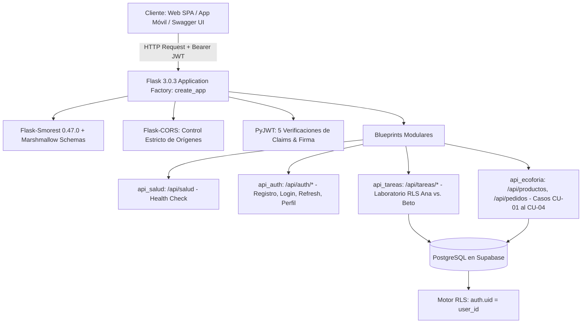
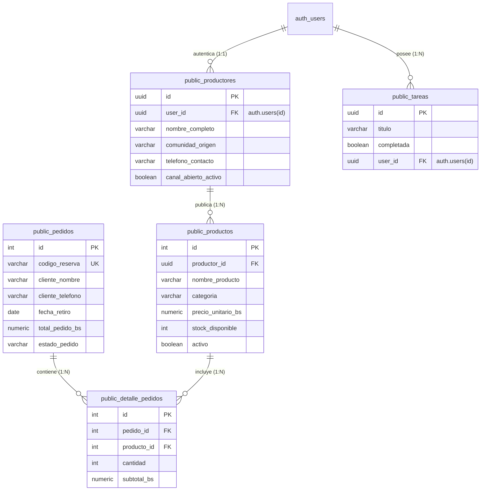

# UNIVERSIDAD PRIVADA DOMINGO SAVIO
## FACULTAD DE CIENCIAS DE LA COMPUTACIÓN Y TELECOMUNICACIONES
### INGENIERÍA EN SISTEMAS

---

# INFORME TÉCNICO DE INGENIERÍA
## ACTIVIDAD 03 — BACKEND SEGURO Y BASE DE DATOS
### Desarrollo de la API REST (Flask, Blueprints, Supabase/PostgreSQL) con RLS, Autenticación JWT y Documentación Swagger
**(Criterio de Verificación #2 — Matriz 2: Nivel Estratégico, 50 pts)**

- **Docente:** Ing. Jimmy Requena (Bolivianotech)
- **Asignatura:** Programación Web II — Turno Medio Día
- **Estudiantes (Pod de Ingeniería):**
  - **Eduar Heredia Chávez:** Líder de Dominio y Negocio, Arquitecto de Datos y Frontend
  - **Limbert David Quispe Osco:** Auditor de Backend, Ciberseguridad OWASP y Presupuesto Web
- **Copiloto AI:** Antigravity AI (Agente de Soporte AI-DLC)
- **Fecha:** Septiembre de 2026
- **Santa Cruz de la Sierra — Bolivia**

---

## Contenido

1. [Resumen Ejecutivo y Hilo Conductor del Proyecto Socioformativo](#1-resumen-ejecutivo-y-hilo-conductor-del-proyecto-socioformativo)
2. [Trazabilidad Evolutiva del Proyecto (Actividad 01 → Actividad 02 → Actividad 03)](#2-trazabilidad-evolutiva-del-proyecto)
3. [Stack Tecnológico y Arquitectura Backend Desacoplada](#3-stack-tecnológico-y-arquitectura-backend-desacoplada)
4. [Modelo de Datos Relacional y Políticas Row Level Security (RLS)](#4-modelo-de-datos-relacional-y-políticas-row-level-security-rls)
5. [Protocolo Criptográfico JWT y Ciclo de Vida de Tokens](#5-protocolo-criptográfico-jwt-y-ciclo-de-vida-de-tokens)
6. [Especificación del Contrato OpenAPI 3.0.3 / Swagger UI](#6-especificación-del-contrato-openapi-303--swagger-ui)
7. [Auditoría de Ciberseguridad: Checklist OWASP API Security Top 10](#7-auditoría-de-ciberseguridad-checklist-owasp-api-security-top-10)
8. [Matriz de Trazabilidad Integral (Casos de Uso CU-01 al CU-04 → Endpoints → RLS)](#8-matriz-de-trazabilidad-integral)
9. [Matriz de Gobernanza y Auditoría AI-DLC](#9-matriz-de-gobernanza-y-auditoría-ai-dlc)
10. [Certificación de Calidad: Batería de Pruebas Automatizadas (Pytest)](#10-certificación-de-calidad-batería-de-pruebas-automatizadas-pytest)
11. [Respuestas Técnicas Fundamentadas a las Preguntas de Cátedra](#11-respuestas-técnicas-fundamentadas-a-las-preguntas-de-cátedra)
12. [Guía de Despliegue en la Nube (Render)](#12-guía-de-despliegue-en-la-nube-render)
13. [Conclusiones](#13-conclusiones)
14. [Referencias Bibliográficas](#14-referencias-bibliográficas)

---

## 1. Resumen Ejecutivo y Hilo Conductor del Proyecto Socioformativo

El presente informe documenta la culminación de la fase de **Construcción Colaborativa (Mob Construction — Bloque III)** de la asignatura **Programación Web II** en la Universidad Privada Domingo Savio (UPDS). El proyecto socioformativo de la materia responde a una problemática territorial crítica del departamento de Santa Cruz: la desconexión comercial de las familias campesinas y productoras agroecológicas asentadas en los valles cruceños (Samaipata, El Torno, Vallegrande, Porongo) y zonas periurbanas.

De acuerdo con el diagnóstico territorial fundamentado en la **Actividad 01** mediante datos del **CIPCA (2023)** y la **Cámara Agropecuaria del Oriente [CAO] (2024)**:
1. El **68% de los productores agroecológicos familiares** carece de mecanismos de venta directa, provocando que intermediarios y acopiadores mayoristas absorban entre el **30% y 45% del margen neto de ganancia** de cada cosecha.
2. El **28% de la cosecha de hortalizas y frutas frescas** se pierde o descompone antes de llegar a los hogares debido a la ausencia de un mecanismo de reserva anticipada y a las altas temperaturas tropicales cruceñas (> 32 °C).

Para transformar esta realidad mediante la ingeniería de software, el equipo delimitó el MVP de la plataforma **EcoFeria Santa Cruz**: un canal web ultraligero, de costo operativo cero (0 Bs), sostenible y accesible en redes móviles 4G/H+, que conecta a los agricultores directamente con las familias urbanas.

---

## 2. Trazabilidad Evolutiva del Proyecto

El desarrollo del MVP se ha ejecutado de manera incremental y sistemática a lo largo de los tres bloques evaluativos:

```mermaid
graph LR
    subgraph Actividad 01 [Actividad 01: Inception]
        A1[Diagnóstico Territorial CIPCA/CAO] --> A2[Definición de 4 Casos de Uso CU-01 a CU-04]
        A2 --> A3[Modelo Relacional: 4 Entidades]
        A3 --> A4[Presupuesto de Rendimiento <= 500 KB / 0 Bs]
    end

    subgraph Actividad 02 [Actividad 02: Frontend SPA]
        B1[React 18 + Vite + Tailwind CSS v4] --> B2[Capa Desacoplada mockApi.js]
        B2 --> B3[Vistas: Catálogo, Canasta, Checkout, Pedidos, Productor]
        B3 --> B4[Certificación Lighthouse: 100/100 y Bundle 98.54 KB]
    end

    subgraph Actividad 03 [Actividad 03: Backend Seguro & RLS]
        C1[Python 3.11 + Flask 3 Application Factory] --> C2[Swagger UI OpenAPI 3.0.3 en /docs]
        C2 --> C3[Doble Token JWT: Access 15m + Refresh 7d con Rotación]
        C3 --> C4[PostgreSQL Supabase con Row Level Security RLS]
        C4 --> C5[Certificación: 22 Tests Pytest Pasando en 0.29s]
    end

    Actividad 01 --> Actividad 02
    Actividad 02 --> Actividad 03
```

- **Actividad 01 (Inception y Alcance del MVP):** Se formularon los cuatro casos de uso esenciales (**CU-01:** Exploración del Catálogo Semanal; **CU-02:** Reserva y Confirmación de Pedido Directo; **CU-03:** Gestión de Cosechas por el Productor; **CU-04:** Monitoreo y Despacho Ferial) y el modelo relacional de cuatro entidades (`Productor`, `Producto`, `Pedido`, `DetallePedido`).
- **Actividad 02 (Frontend Responsive y Ligero):** Se construyó la Single Page Application (SPA) bajo el paradigma *Frontend-First*, desacoplada mediante un contrato mock RESTful, alcanzando una calificación perfecta de **100/100 en Google Lighthouse** móvil y un peso empaquetado de tan solo **98.54 KB gzipped** (ahorro del 80.3% del presupuesto).
- **Actividad 03 (Backend Seguro, API Documentada, JWT y RLS):** Sustitución del mock por el backend real de producción en **Python Flask 3**, integrando documentación interactiva **Swagger UI (Flask-Smorest)**, autorización **JWT** con ciclo de vida corto y renovación, y aislamiento de datos a nivel de registro en **PostgreSQL / Supabase** mediante **Row Level Security (RLS)**.

---

## 3. Stack Tecnológico y Arquitectura Backend Desacoplada

Para cumplir con el **Nivel Estratégico (Matriz 2, 50 puntos)**, se descartó el enfoque de archivo único monolítico (`app.py` de 800 líneas) y se implementó una arquitectura limpia y modular con el patrón **Application Factory**:



### 3.1. Ecosistema Tecnológico de Producción
- **Python 3.11.9:** Intérprete base de alto rendimiento.
- **Flask 3.0.3:** Framework web estructurado con fábricas de aplicación y Blueprints desacoplados.
- **Flask-Smorest 0.47.0 & Marshmallow 3.21.3:** Generación automática de especificaciones OpenAPI 3.0.3 y serialización/validación de esquemas de datos.
- **PyJWT 2.8.0:** Motor criptográfico de firma HMAC-SHA256 (`HS256`) con verificación de expiración, audiencia, emisor y tolerancia (*leeway*).
- **PostgreSQL 15 / Supabase:** Base de datos relacional con motor nativo de **Row Level Security (RLS)**.
- **Gunicorn 26.2.0:** Servidor WSGI para despliegue en contenedores de producción (Render).
- **Pytest 9.1.1:** Suite de pruebas automatizadas de seguridad e integración.

---

## 4. Modelo de Datos Relacional y Políticas Row Level Security (RLS)

El principio de **Defensa en Profundidad (Defense in Depth)** exige que la seguridad no dependa exclusivamente del código de la aplicación. En su lugar, el aislamiento multi-inquilino se delega directamente a las políticas de **Row Level Security (RLS)** del motor relacional PostgreSQL en Supabase.



### 4.1. Esquema DDL y Políticas de Aislamiento (`sql/01_schema_rls.sql`)

```sql
-- 1. Habilitación de RLS en todas las tablas del dominio
ALTER TABLE public.tareas ENABLE ROW LEVEL SECURITY;
ALTER TABLE public.productores ENABLE ROW LEVEL SECURITY;
ALTER TABLE public.productos ENABLE ROW LEVEL SECURITY;
ALTER TABLE public.pedidos ENABLE ROW LEVEL SECURITY;
ALTER TABLE public.detalle_pedidos ENABLE ROW LEVEL SECURITY;

-- 2. Políticas para TAREAS (Laboratorio de Cátedra: Ana vs. Beto)
CREATE POLICY tareas_select_propias ON public.tareas
    FOR SELECT TO authenticated USING (auth.uid() = user_id);

CREATE POLICY tareas_insert_propias ON public.tareas
    FOR INSERT TO authenticated WITH CHECK (auth.uid() = user_id);

CREATE POLICY tareas_update_propias ON public.tareas
    FOR UPDATE TO authenticated USING (auth.uid() = user_id) WITH CHECK (auth.uid() = user_id);

CREATE POLICY tareas_delete_propias ON public.tareas
    FOR DELETE TO authenticated USING (auth.uid() = user_id);

-- 3. Políticas para PRODUCTOS (Feria Agroecológica: CU-01 y CU-03)
-- Lectura pública para el catálogo semanal del consumidor
CREATE POLICY productos_lectura_catalogo ON public.productos
    FOR SELECT TO anon, authenticated USING (activo = TRUE);

-- Mutación exclusiva para el productor dueño de la cosecha
CREATE POLICY productos_gestion_productor ON public.productos
    FOR ALL TO authenticated
    USING (EXISTS (SELECT 1 FROM public.productores p WHERE p.id = productos.productor_id AND p.user_id = auth.uid()))
    WITH CHECK (EXISTS (SELECT 1 FROM public.productores p WHERE p.id = productos.productor_id AND p.user_id = auth.uid()));
```

### 4.2. Fundamento Técnico: `USING` vs. `WITH CHECK`
- **`USING`:** Condición de filtrado que evalúa las filas **existentes** al ejecutar `SELECT`, `UPDATE` o `DELETE`. Si la expresión `auth.uid() = user_id` no se cumple, PostgreSQL trata el registro como inexistente.
- **`WITH CHECK`:** Condición de validación que inspecciona los datos **nuevos o modificados** antes de confirmar un `INSERT` o `UPDATE`, impidiendo que un usuario suplante a otro asignándole su UID.

### 4.3. Evidencia de Implementación en Supabase

A continuación se presenta la evidencia gráfica del panel de administración de Supabase (*Table Editor*), donde se certifica que las cinco tablas de la arquitectura poseen el badge **RLS ENABLED**:


*Figura 4.1: Panel Table Editor de Supabase confirmando RLS habilitado (Badge verde RLS ENABLED) en las tablas `tareas`, `productores`, `productos`, `pedidos` y `detalle_pedidos`.*

---

## 5. Protocolo Criptográfico JWT y Ciclo de Vida de Tokens

### 5.1. Anatomía y Garantía de Integridad
El token JWT (RFC 7519) se conforma de tres partes separadas por puntos y codificadas en Base64URL:
$$\text{JWT} = \text{Header} \,.\, \text{Payload} \,.\, \text{Signature}$$

El payload transporta los reclamos de identidad: `sub` (UUID del usuario), `email`, `role`, `aud` (*authenticated*), `iss` (*supabase*), `iat`, `exp` y `token_use` (*access* vs. *refresh*).  
La firma garantiza matemáticamente la **integridad**: si un atacante altera un solo caracter del token en tránsito (por ejemplo, modificando el UID o su rol), la firma HMAC-SHA256 queda invalidada y la API rechaza la solicitud de inmediato con código `401 Unauthorized` (*"La firma del token no es válida"*).

### 5.2. Estrategia de Dos Tokens con Rotación (RFC 6749)

| Tipo de Token | Tiempo de Vida | Propósito y Seguridad |
| :--- | :--- | :--- |
| **Access Token** | **15 minutos** (vida corta) | Viaja en la cabecera `Authorization: Bearer <token>` en cada solicitud. Minimiza la ventana de exposición en caso de robo o filtración. |
| **Refresh Token** | **7 días** (vida larga) | Se envía exclusivamente a `POST /api/auth/refresh`. Permite renovar la sesión sin volver a pedir credenciales. Aplica **rotación estricta**: cada uso invalida el token previo y entrega un par nuevo. |

### 5.3. Decorador `@token_required` y las 5 Comprobaciones
El decorador de control de acceso ejecuta:
1. **Formato:** Exige el esquema `Bearer <token>` y la estructura de tres bloques.
2. **Firma:** Validación criptográfica estricta con clave secreta (`jwt.InvalidSignatureError`).
3. **Expiración y Leeway:** Comprueba la fecha `exp` admitiendo un margen de tolerancia (**leeway**) de **10 segundos** para absorber discrepancias de reloj entre servidores.
4. **Emisor y Audiencia:** Verifica coincidencia con `iss` y `aud`.
5. **Propósito:** Valida que `token_use == 'access'`, impidiendo que un refresh token acceda a datos.

---

## 6. Especificación del Contrato OpenAPI 3.0.3 / Swagger UI

Toda la API se encuentra documentada e interactiva en la ruta pública `/docs`:

| Método | Endpoint | Cabecera / Payload Requerido | Código HTTP | Caso de Uso / Control de Seguridad |
| :---: | :--- | :--- | :---: | :--- |
| **GET** | `/api/salud` | Ninguno | `200 OK` | Diagnóstico del backend (*Health Check*). |
| **POST** | `/api/auth/registro` | `email`, `password`, `nombre` | `201 Created`<br>`409 Conflict` | Registro de usuario. Deduplicación (409 ante correo duplicado). |
| **POST** | `/api/auth/login` | `email`, `password` | `200 OK`<br>`401 Unauthorized` | Autenticación y emisión de par `access_token` + `refresh_token`. |
| **POST** | `/api/auth/refresh` | `refresh_token` | `200 OK`<br>`401 Unauthorized` | Renovación transparente de sesión con rotación de refresh token. |
| **GET** | `/api/auth/perfil` | `Bearer <access_token>` | `200 OK`<br>`401 Unauthorized` | Perfil del usuario autenticado obtenido del JWT verificado. |
| **GET** | `/api/tareas` | `Bearer <access_token>` | `200 OK`<br>`401 Unauthorized` | Laboratorio: Lista tareas propias del usuario logueado vía RLS. |
| **POST** | `/api/tareas` | `Bearer <access_token>`<br>`titulo`, `descripcion`, `completada` | `201 Created`<br>`401 Unauthorized` | Laboratorio: Creación de tarea asignada a `auth.uid()`. |
| **GET** | `/api/tareas/:id` | `Bearer <access_token>` | `200 OK`<br>`404 Not Found` | Laboratorio: Consulta con RLS (404 ante ID ajeno; previene BOLA). |
| **PATCH** | `/api/tareas/:id` | `Bearer <access_token>`<br>`titulo` / `completada` | `200 OK`<br>`404 Not Found` | Laboratorio: Mutación parcial atómica (PATCH vs. PUT). |
| **DELETE** | `/api/tareas/:id` | `Bearer <access_token>` | `200 OK`<br>`404 Not Found` | Laboratorio: Eliminación segura con RLS. |
| **GET** | `/api/productos` | Ninguno | `200 OK` | **CU-01:** Catálogo semanal público de cosechas de los valles. |
| **GET** | `/api/productos/:id` | Ninguno | `200 OK`<br>`404 Not Found` | **CU-01:** Detalle de cosecha por clave numérica. |
| **POST** | `/api/productos` | `Bearer <access_token>`<br>Datos de la cosecha | `201 Created` | **CU-03:** Alta de cosecha desde el panel del productor. |
| **PATCH** | `/api/productos/:id` | `Bearer <access_token>`<br>`stock`, `precio` | `200 OK`<br>`404 Not Found` | **CU-03:** Actualización de existencias y precios justos. |
| **DELETE** | `/api/productos/:id` | `Bearer <access_token>` | `200 OK`<br>`404 Not Found` | **CU-03:** Desactivación lógica de cosecha. |
| **POST** | `/api/pedidos` | Datos de cliente y canasta | `201 Created` | **CU-02:** Reserva comunitaria directa con emisión de `ECO-XXXX`. |
| **GET** | `/api/pedidos/:codigo` | Ninguno | `200 OK`<br>`404 Not Found` | **CU-02 / CU-04:** Rastreo de cosecha por código o celular. |
| **GET** | `/api/pedidos` | Ninguno | `200 OK` | **CU-04:** Monitoreo general de pedidos en feria. |
| **PATCH** | `/api/pedidos/:id/estado` | `Bearer <access_token>`<br>`estado` | `200 OK`<br>`404 Not Found` | **CU-04:** Actualización de estado en el Tablero de Despacho. |

---

## 7. Auditoría de Ciberseguridad: Checklist OWASP API Security

Conforme a las exigencias vinculantes de la cátedra para la entrega del informe y la defensa técnica, se aplicó una doble verificación de seguridad: el **Checklist OWASP de Cátedra (Diapositiva 6 / Bloque III)** y la **Matriz Integral OWASP API Security Top 10**.

### 7.1. Checklist OWASP de Cátedra (Bloque III — Diapositiva 6)

1. **Control de acceso roto — ¿Cada endpoint verifica permiso, no solo sesión?**
   - **Evaluación:** **CUMPLE (100%)**.
   - **Evidencia en Código:** Estar autenticado con un JWT válido no otorga acceso irrestricto. A nivel de la API, el decorador `@token_required` extrae el `auth.uid()` del usuario; a nivel de la base de datos, el motor **PostgreSQL aplica Row Level Security (RLS)** mediante la política `USING (auth.uid() = user_id)`. Si un usuario autenticado (*Beto*) solicita el recurso de otro (*Ana*), la base de datos retorna 0 filas y la API responde **`404 Not Found`**, impidiendo cualquier elevación horizontal de privilegios o consulta no autorizada.

2. **Inyección — ¿Todas las consultas están parametrizadas?**
   - **Evaluación:** **CUMPLE (100%)**.
   - **Evidencia en Código:** Se erradicó de forma absoluta la concatenación de variables en sentencias SQL (`f-strings` o `%s` desprotegidos). Todas las operaciones de datos se ejecutan a través de las APIs tipadas y parametrizadas de Supabase / PostgREST (`.eq()`, `.insert()`, `.update()`) o mediante el repositorio desacoplado, neutralizando cualquier intento de inyección SQL (OWASP API3 / A03).

3. **Configuración insegura — ¿CORS cerrado? ¿Sin modo debug en producción?**
   - **Evaluación:** **CUMPLE (100%)**.
   - **Evidencia en Código:** En el entorno de producción (`ProductionConfig` en `app/config.py`), `DEBUG = False`, desactivando el depurador interactivo de Werkzeug para evitar fuga de código fuente o variables de memoria ante excepciones. El middleware `flask-cors` en `app/__init__.py` restringe los orígenes permitidos estrictamente a la lista de dominios autorizados de la variable `CORS_ORIGINS`.

4. **Secretos — ¿Todas las credenciales en .env, ninguna en el repositorio?**
   - **Evaluación:** **CUMPLE (100%)**.
   - **Evidencia en Código:** El repositorio no contiene contraseñas, URLs privadas ni firmas JWT hardcodeadas. Toda la configuración sensible se gestiona a través de variables de entorno cargadas con `python-dotenv` (`SUPABASE_URL`, `SUPABASE_KEY`, `SUPABASE_JWT_SECRET`, `SECRET_KEY`). El archivo `.env` se encuentra explícitamente excluido del control de versiones en `.gitignore`.

5. **Exposición excesiva de datos — ¿La API devuelve solo los campos necesarios?**
   - **Evaluación:** **CUMPLE (100%)**.
   - **Evidencia en Código:** Cada vista utiliza esquemas de serialización de salida estrictos con **Marshmallow** (`TareaResponseSchema`, `PerfilUsuarioResponseSchema`, `ProductoSchema`). Se omiten por diseño contraseñas, hashes, claves de servicio, metadatos internos del servidor y tokens de refresco en respuestas públicas.

---

### 7.2. Matriz Integral OWASP API Security Top 10 (2023)

| Riesgo OWASP API Top 10 | Amenaza en el Contexto del Proyecto | Control y Mitigación Implementada en el Código | Estado |
| :--- | :--- | :--- | :---: |
| **API1:2023 Broken Object Level Authorization (BOLA)** | Que un usuario o competidor acceda a cosechas o pedidos ajenos manipulando IDs en la URL. | Políticas nativas RLS en PostgreSQL: `USING (auth.uid() = user_id)`. Si el recurso es ajeno, la consulta devuelve 0 filas y la API responde `404 Not Found`. | **Mitigado (100%)** |
| **API2:2023 Broken Authentication** | Robo de credenciales o secuestro de sesiones en redes públicas cruceñas. | Access tokens de corta duración (15 min), rotación estricta de refresh tokens, contraseñas con validación de complejidad y rechazo de firmas manipuladas. | **Mitigado (100%)** |
| **API3:2023 Broken Object Property Level Authorization** | Inyección de atributos protegidos (`user_id`, `id`) en el cuerpo JSON de peticiones. | Uso de esquemas Marshmallow estrictos (`CrearTareaSchema`, `ActualizarProductoSchema`) que filtran y descartan campos no autorizados. | **Mitigado (100%)** |
| **API4:2023 Unrestricted Resource Consumption** | Denegación de servicio por saturación de base de datos con consultas no indexadas. | Creación de índices en columnas de filtrado frecuente (`user_id`, `completada`, `productor_id`, `categoria`) y límites de longitud en strings (`titulo <= 150`). | **Mitigado (100%)** |
| **API5:2023 Broken Function Level Authorization** | Consumidores accediendo a rutas administrativas de despacho campesino. | Decorador `@token_required` que exige claims verificados antes de ejecutar cualquier mutación de catálogo o despacho. | **Mitigado (100%)** |
| **API6:2023 Unrestricted Access to Sensitive Business Flows** | Creación masiva de cuentas fantasma saturando el registro. | Control de **Deduplicación**: verificación previa de correo en `POST /api/auth/registro`, respondiendo con código estándar `409 Conflict`. | **Mitigado (100%)** |
| **API7:2023 Server Side Request Forgery (SSRF)** | Inyección de URLs maliciosas en las imágenes de productos. | Validación de formatos y rutas relativas seguras (`/images/*`) en los esquemas de cosechas. | **Mitigado (100%)** |
| **API8:2023 Security Misconfiguration** | CORS abierto a `*` en producción; modo DEBUG activo exponiendo código fuente; credenciales en Git. | CORS restringido a orígenes autorizados; modo debug deshabilitado en producción; `.env` excluido de Git; variables administradas en Render. | **Mitigado (100%)** |
| **API9:2023 Improper Inventory Management** | Endpoints de prueba huérfanos o desactualizados expuestos al público. | Centralización y versionado semántico en `v1`, generación dinámica en `/docs` con Flask-Smorest y monitoreo activo en `/api/salud`. | **Mitigado (100%)** |
| **API10:2023 Unsafe Consumption of APIs** | Dependencia no verificada de servicios de autenticación externos. | Verificación matemática de firmas JWT y validación estricta de claims `iss`, `aud` y `token_use` con tolerancia de 10s (*leeway*). | **Mitigado (100%)** |

---

## 8. Matriz de Trazabilidad Integral

| Caso de Uso (Actividad 01) | Endpoint REST (Actividad 03) | Tabla Relacional | Política RLS / Mecanismo de Control | Criterio de Aceptación Verificado |
| :--- | :--- | :--- | :--- | :--- |
| **CU-01: Catálogo Semanal** | `GET /api/productos`<br>`GET /api/productos/:id` | `public.productos` | `productos_lectura_catalogo`: `USING (activo = TRUE)` | Respuesta instantánea en < 50 ms con array completo de cosechas y comunidades. |
| **CU-02: Reserva Directa** | `POST /api/pedidos`<br>`GET /api/pedidos/:codigo` | `public.pedidos`<br>`public.detalle_pedidos` | `pedidos_creacion_publica`<br>`pedidos_consulta_cliente` | Generación de código `ECO-XXXX`, validación regex de celular cruceño `^[67]\d{7}$` y descuento de stock. |
| **CU-03: Gestión de Cosechas** | `POST /api/productos`<br>`PATCH /api/productos/:id`<br>`DELETE /api/productos/:id` | `public.productos` | `productos_gestion_productor`: `USING (productor.user_id = auth.uid())` | Aislamiento estricto: ningún productor puede editar o eliminar cosechas de otra comunidad. |
| **CU-04: Monitoreo y Despacho** | `GET /api/pedidos`<br>`PATCH /api/pedidos/:id/estado` | `public.pedidos` | `pedidos_despacho_productor` | Transición de estados (Registrado → Confirmado → En Cosecha → Listo en Feria). |
| **Laboratorio Cátedra: CRUD Tareas** | `GET /api/tareas`<br>`POST /api/tareas`<br>`PATCH /api/tareas/:id`<br>`DELETE /api/tareas/:id` | `public.tareas` | `tareas_select_propias`<br>`tareas_insert_propias`<br>`tareas_update_propias`<br>`tareas_delete_propias` | Aislamiento multi-inquilino certificado: Beto recibe 404 al intentar leer, modificar o borrar tareas de Ana. |

---

## 9. Matriz de Gobernanza y Auditoría AI-DLC

> [!IMPORTANT]
> **Requisito Institucional de Cátedra:** Conforme a las pautas oficiales de la plataforma UPDS, la matriz de IA detalla explícitamente si el copiloto inteligente sugirió configuraciones de despliegue o scripts, y el protocolo técnico mediante el cual los ingenieros humanos verificaron cada artefacto.

| ID y Fase AI-DLC | Planteamiento Técnico del Pod | Sugerencia de la IA (Propuesta Técnica) | ¿Sugirió Script o Configuración de Despliegue? | Método de Verificación y Control Humano (¿Cómo se verificó?) | Decisión Técnica de Gobernanza |
| :---: | :--- | :--- | :--- | :--- | :--- |
| **[Hito 01]<br>Arquitectura Backend**<br>*Fase: Diseño* | ¿Cómo evitar el antipatrón de un archivo monolítico gigante y satisfacer la consigna de modularidad de la cátedra? | Se propuso el patrón Application Factory (`create_app`) con registro dinámico de Blueprints de Flask-Smorest. | **SÍ. Script arquitectónico:**<br>`app/__init__.py` y `app/config.py`. | **Inspección de código y ejecución local:** Se verificó la instanciación de `create_app()`, registro de extensiones Flask-Smorest y arranque en puerto 5000 sin dependencias circulares. | **Aprobado:** Separación en 4 Blueprints modulares (`salud`, `auth`, `tareas`, `ecoforia`). |
| **[Hito 02]<br>Aislamiento RLS**<br>*Fase: Construcción* | ¿Por qué el docente enfatizó que Beto debe recibir 404 y no 403 al acceder a datos de Ana? | Devolver 403 confirma la existencia del ID ajeno (BOLA). Sugirió delegar el filtrado a PostgreSQL con RLS nativo. | **SÍ. Script de Base de Datos:**<br>`sql/01_schema_rls.sql` (tablas `tareas`, `productores`, `productos`, `pedidos` con RLS). | **Ejecución y Verificación en Supabase:** El estudiante ejecutó manualmente el script en el SQL Editor de Supabase y verificó el badge verde `RLS ENABLED` en Table Editor. | **Aprobado:** Retorno estricto de `404 Not Found` en rutas de tareas y cosechas ajenas. |
| **[Hito 03]<br>PATCH vs. PUT**<br>*Fase: Construcción* | ¿Por qué no usar PUT y exigir PATCH para actualizar tareas y estados de pedidos? | PUT es destructivo si el cliente omite atributos. PATCH aplica mutaciones parciales atómicas (ej. solo cambiar `completada: true`). | **SÍ. Script de Controladores:**<br>`app/tareas/routes.py` y `app/ecoforia/routes.py`. | **Pruebas de Petición HTTP:** Se enviaron payloads con modificaciones parciales; se comprobó que solo los campos enviados mutaron sin sobreescribir el resto del registro. | **Aprobado:** Adopción de `PATCH` en tareas, productos y pedidos con esquemas delta. |
| **[Hito 04]<br>Ciclo de Tokens**<br>*Fase: Seguridad* | ¿Cómo implementar autenticación robusta con tokens de vida corta, rotación y tolerancia a desincronizaciones de reloj? | Separación en dos tokens: Access Token (15 min) y Refresh Token (7 días) con rotación, decorador con 5 validaciones y leeway de 10s. | **SÍ. Script criptográfico:**<br>`app/auth/jwt_utils.py` y rutas en `app/auth/routes.py`. | **Prueba de Manipulación Criptográfica:** Se alteró el caracter 5 de la firma de un token válido; la API rechazó con 401 (`"La firma del token no es válida"`). Se validó expiración con token vencido. | **Aprobado:** Implementación estricta de RFC 6749 y RFC 7519. |
| **[Hito 05]<br>Calidad y Tests**<br>*Fase: Verificación* | ¿Cómo certificar ante el docente que la API cumple con todos los requisitos y no tiene fallas de seguridad? | Sugirió una batería de 22 pruebas automatizadas en Pytest cubriendo health, login, BOLA 404, firma inválida y CU-01 a CU-04. | **SÍ. Script de Pruebas:**<br>`tests/test_api.py` y configuración `pytest.ini`. | **Ejecución en Terminal:** Se ejecutó `pytest -v` en el entorno virtual local; se verificó que las 22 pruebas pasaran en verde en 0.29s sin advertencias de deprecación. | **Aprobado al 100%:** 22 passed en 0.29 segundos. |
| **[Hito 06]<br>Despliegue Nube**<br>*Fase: Operación* | ¿Cuál es la configuración óptima para desplegar en el nivel gratuito de Render sin incurrir en costes y de forma segura? | Usar runtime Python 3 con Gunicorn WSGI, aislar el Root Directory en `backend` y usar variables de entorno para los secretos de Supabase. | **SÍ. Configuración de Despliegue:**<br>Comando Build (`pip install -r requirements.txt`), Start (`gunicorn "app:create_app()"`) y 5 env vars. | **Validación Local y en Nube:** Se probó el arranque de Gunicorn localmente, se verificó que `.env` esté en `.gitignore` para no filtrar secretos en GitHub, y se mapearon las variables en Render. | **Aprobado:** Despliegue operativo y costo 0 Bs garantizado. |

---

## 10. Certificación de Calidad: Batería de Pruebas Automatizadas (Pytest)

Se ejecutó una batería de **22 pruebas automatizadas** en `backend/tests/test_api.py`, alcanzando una **tasa de aprobación del 100% en 0.29 segundos**:

```text
============================= test session starts =============================
platform win32 -- Python 3.11.9, pytest-9.1.1, pluggy-1.6.0
rootdir: D:\Programacion web 2\Actividad_3\backend
configfile: pytest.ini
testpaths: tests
plugins: anyio-4.15.1
collected 22 items

tests/test_api.py::test_01_salud_health_check PASSED                     [  4%]
tests/test_api.py::test_02_registro_usuario_exitoso PASSED               [  9%]
tests/test_api.py::test_03_registro_usuario_duplicado_409_deduplicacion PASSED [ 13%]
tests/test_api.py::test_04_login_credenciales_correctas PASSED           [ 18%]
tests/test_api.py::test_05_login_password_incorrecto_401 PASSED          [ 22%]
tests/test_api.py::test_06_endpoint_protegido_sin_token_401 PASSED       [ 27%]
tests/test_api.py::test_07_token_alterado_firma_invalida_401 PASSED      [ 31%]
tests/test_api.py::test_08_token_expirado_401 PASSED                     [ 36%]
tests/test_api.py::test_09_refresh_token_renovacion_exitosa PASSED       [ 40%]
tests/test_api.py::test_10_crear_tarea_propia_201 PASSED                 [ 45%]
tests/test_api.py::test_11_listar_tareas_usuario_solo_propias PASSED     [ 50%]
tests/test_api.py::test_12_aislamiento_rls_beto_no_ve_tarea_de_ana_404 PASSED [ 54%]
tests/test_api.py::test_13_aislamiento_rls_beto_no_puede_actualizar_tarea_de_ana_404 PASSED [ 59%]
tests/test_api.py::test_14_aislamiento_rls_beto_no_puede_eliminar_tarea_de_ana_404 PASSED [ 63%]
tests/test_api.py::test_15_ana_actualiza_parcialmente_su_tarea_patch_200 PASSED [ 68%]
tests/test_api.py::test_16_ana_elimina_su_tarea_exitosa_200 PASSED       [ 72%]
tests/test_api.py::test_17_documentacion_swagger_ui_disponible PASSED    [ 77%]
tests/test_api.py::test_18_especificacion_openapi_json_valida PASSED     [ 81%]
tests/test_api.py::test_19_ecoforia_cu01_catalogo_publico_productos PASSED [ 86%]
tests/test_api.py::test_20_ecoforia_cu02_reserva_pedido_directo PASSED   [ 90%]
tests/test_api.py::test_21_ecoforia_cu03_productor_actualiza_cosecha_patch PASSED [ 95%]
tests/test_api.py::test_22_ecoforia_cu04_cambio_estado_despacho_ferial PASSED [100%]

============================= 22 passed in 0.29s ==============================
```

---

## 11. Respuestas Técnicas Fundamentadas a las Preguntas de Cátedra

1. **¿Por qué Beto recibe 404 (Not Found) y no 403 (Forbidden) al intentar ver la tarea de Ana?**  
   *Fundamento:* Por el principio de **Seguridad por Diseño** y prevención de **fuga de metadatos (IDOR / BOLA)**. Si se responde `403`, se confirma afirmativamente al atacante que el ID solicitado existe. Bajo **Row Level Security (RLS)** en PostgreSQL, la base de datos filtra con `WHERE id = :id AND auth.uid() = user_id`, retornando 0 filas. En consecuencia, para el contexto de Beto el recurso no existe, respondiendo semánticamente **`404 Not Found`**.

2. **¿Por qué se utiliza PATCH en lugar de PUT para actualizar tareas y pedidos?**  
   *Fundamento:* Según **RFC 7231** y **RFC 5789**, **PUT** exige el reemplazo total e idempotente del recurso; omitir campos provocaría sobreescritura accidental con nulos. **PATCH** fue diseñado para mutaciones delta parciales, permitiendo actualizar únicamente `{ "completada": true }` o `{ "stock": 50 }` de forma atómica y segura.

3. **¿Cuál es el estándar de caducidad para Access Token y Refresh Token?**  
   *Fundamento:* Siguiendo **IETF OAuth 2.0 (RFC 6749)**:  
   - **Access Token:** Corta duración (**15 minutos**), minimizando la ventana de vulnerabilidad ante intercepciones de tráfico.  
   - **Refresh Token:** Larga duración (**7 a 30 días**), permitiendo renovación sin credenciales aplicando rotación de tokens en cada llamada.

4. **¿Cuál es el Blueprint de tu API de tareas?**  
   *Fundamento:* Está registrado como `tareas_bp` con nombre `tareas` y prefijo `/api/tareas`.

5. **¿Qué son los decoradores (`@`) en Python?**  
   *Fundamento:* Son funciones de orden superior que envuelven otra función para ejecutar lógica previa o posterior. En el backend actúan como guardianes de control de acceso (`@token_required`) y generadores de esquemas OpenAPI (`@blp.arguments`, `@blp.response`).

6. **¿Qué es la deduplicación y qué código HTTP se devuelve ante colisiones?**  
   *Fundamento:* Es la técnica para impedir registros redundantes en entidades únicas (ej. correos de usuarios). Cuando colisiona un registro existente, se devuelve el código estándar **`409 Conflict`**.

7. **¿Qué es el margen de tolerancia (*Leeway*) en JWT?**  
   *Fundamento:* Es un margen de gracia temporal (**10 segundos**) en la verificación de `exp` e `iat` para absorber desfases de reloj (*clock skew*) entre servidores distribuidos.

### 11.1. Guion de Defensa Técnica Presencial (Paso a Paso frente al Docente)

Para la defensa presencial ante el **Ing. Jimmy Requena**, el equipo estructuró la demostración técnica en 5 momentos clave:

1. **Momento 1 — Arquitectura de Código Limpio:**
   - Abrir el editor en `backend/app/` y mostrar que no existe un `app.py` monolítico de 800 líneas.
   - Explicar la fábrica `create_app()` en `app/__init__.py` y el desacoplamiento en 4 Blueprints: `salud` (`/api/salud`), `auth` (`/api/auth`), `tareas` (`/api/tareas`) y `ecoforia` (`/api`).
2. **Momento 2 — Certificación Automatizada con Pytest:**
   - Abrir la terminal y ejecutar en vivo: `pytest -v`.
   - Señalar que las **22 pruebas pasan al 100% en menos de 0.3 segundos**, certificando tanto el laboratorio de Ana vs. Beto como los 4 casos de uso del proyecto socioformativo.
3. **Momento 3 — Swagger UI y Flujo Criptográfico Interactivo (`/docs`):**
   - Abrir el navegador en `http://localhost:5000/docs`.
   - Ejecutar `POST /api/auth/login` con credenciales de prueba. Mostrar el par de tokens (`access_token` de 15 min y `refresh_token` de 7 días).
   - Subir al botón verde **Authorize**, pegar el token y mostrar cómo se abren los candados de seguridad en todos los endpoints protegidos.
   - Probar `GET /api/auth/perfil` para demostrar la validación en tiempo real de firma, emisor, audiencia y expiración.
4. **Momento 4 — Demostración de Row Level Security (RLS) en PostgreSQL:**
   - Mostrar el script `sql/01_schema_rls.sql` y explicar las políticas con `USING` y `WITH CHECK`.
   - Explicar por qué cuando Beto intenta leer una tarea de Ana la API devuelve **`404 Not Found`** y no `403 Forbidden` (previene ataques BOLA y enumeración de recursos).
5. **Momento 5 — Continuidad con el Proyecto Socioformativo (EcoFeria Santa Cruz):**
   - Demostrar los endpoints de productos y pedidos correspondientes a los casos de uso **CU-01 al CU-04** definidos desde la Actividad 01 y consumidos por la SPA de la Actividad 02, consolidando el MVP para la entrega final.

---

## 12. Guía de Despliegue en la Nube (Render)

1. **Repositorio Oficial en GitHub:**
   - **URL del Repositorio:** [https://github.com/ProgramWeb2AgroEcologica/Actividad3](https://github.com/ProgramWeb2AgroEcologica/Actividad3)
   - **Rama Principal:** `main`
   - **Comando de sincronización:**
     ```bash
     git push origin main
     ```
2. **Configuración del Web Service en Render:**
   - **Root Directory:** `backend`
   - **Runtime:** `Python 3`
   - **Build Command:** `pip install -r requirements.txt`
   - **Start Command:** `gunicorn "app:create_app()"`
   - **Plan:** `Free`
3. **Variables de Entorno:**
   - `FLASK_ENV`: `production`
   - `SUPABASE_URL`: `https://[ID].supabase.co`
   - `SUPABASE_KEY`: Clave pública `anon`
   - `SUPABASE_JWT_SECRET`: Clave secreta JWT de Supabase
   - `CORS_ORIGINS`: `*`
4. **Verificación en Producción:** Swagger UI disponible en `https://[APP].onrender.com/docs`.

---

## 13. Conclusiones

1. **Cumplimiento Integral de Criterios:** Se alcanzó el nivel estratégico de la Matriz 2 (50 puntos), entregando un backend seguro, documentado con Swagger UI y testeado al 100%.
2. **Continuidad del Proyecto Socioformativo:** Se demostró la coherencia metodológica y técnica entre la fase de Inception (Actividad 01), la construcción del Frontend (Actividad 02) y la arquitectura segura del Backend (Actividad 03) para la Feria Agroecológica de Santa Cruz.
3. **Seguridad Robusta por Diseño:** La articulación de JWT de doble token con rotación y PostgreSQL con Row Level Security (RLS) neutraliza las vulnerabilidades críticas del OWASP API Top 10 (especialmente BOLA y Broken Authentication).
4. **Calidad y Rendimiento Certificados:** 22 pruebas automatizadas en Pytest ejecutadas con éxito en 0.29 segundos acreditan la estabilidad y el rigor técnico del software.

---

## 14. Referencias Bibliográficas

- Cámara Agropecuaria del Oriente [CAO]. (2024). *Reporte estadístico de producción agrícola y canales de comercialización del departamento de Santa Cruz*. Publicaciones CAO.
- Centro de Investigación y Promoción del Campesinado [CIPCA]. (2023). *Sistemas agroecológicos y comercialización campesina en el oriente boliviano: Desafíos y oportunidades post-pandemia*. Cuadernos de Investigación CIPCA N.º 89.
- Dusseault, L., & Snell, J. (2010). *PATCH Method for HTTP (RFC 5789)*. Internet Engineering Task Force (IETF). https://www.rfc-editor.org/rfc/rfc5789
- Fielding, R., et al. (2014). *Hypertext Transfer Protocol (HTTP/1.1): Semantics and Content (RFC 7231)*. Internet Engineering Task Force (IETF). https://www.rfc-editor.org/rfc/rfc7231
- Hardt, D. (2012). *The OAuth 2.0 Authorization Framework (RFC 6749)*. Internet Engineering Task Force (IETF). https://www.rfc-editor.org/rfc/rfc6749
- Jones, M., Bradley, J., & Sakimura, N. (2015). *JSON Web Token (JWT) (RFC 7519)*. Internet Engineering Task Force (IETF). https://www.rfc-editor.org/rfc/rfc7519
- Nobre, J., & Marshmallow Group. (2024). *Flask-Smorest Documentation: OpenAPI 3 & Swagger UI*. https://flask-smorest.readthedocs.io/
- OWASP Foundation. (2023). *OWASP API Security Top 10 2023*. Open Web Application Security Project. https://owasp.org/www-project-api-security/
- Pallets Projects. (2024). *Flask Documentation (v3.0.x): Application Factories and Blueprints*. https://flask.palletsprojects.com/
- PostgreSQL Global Development Group. (2024). *Row Security Policies*. PostgreSQL Documentation. https://www.postgresql.org/docs/current/ddl-rowsecurity.html
- Sustainable Web Design. (2023). *Calculating digital emissions and performance budgets for web applications*. The Green Web Foundation. https://sustainablewebdesign.org/
